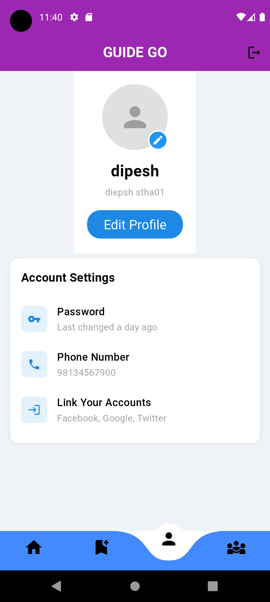

# Guide Go
A Complete Tourist Guide Hiring Solution.

Guide Go is a user-friendly mobile app built with Flutter, designed to make hiring a tourist guide in Nepal quick and hassle-free. Whether you're exploring the Himalayas or wandering through ancient cities, the app lets you choose your destination, browse verified guides, and book them easily. With real-time availability, and a smooth interface, Guide Go ensures travelers find the right guide for a personalized and memorable experience.

- [Lab: Write your first Flutter app](https://docs.flutter.dev/get-started/codelab)
- [Cookbook: Useful Flutter samples](https://docs.flutter.dev/cookbook)

For help getting started with Flutter development, view the
[online documentation](https://docs.flutter.dev/), which offers tutorials,
samples, guidance on mobile development, and a full API reference.
